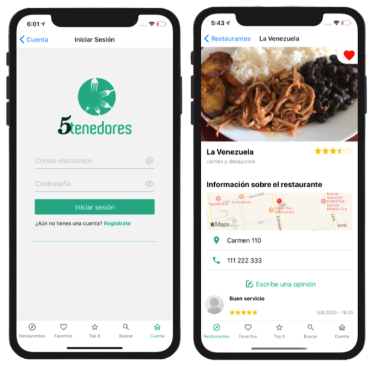
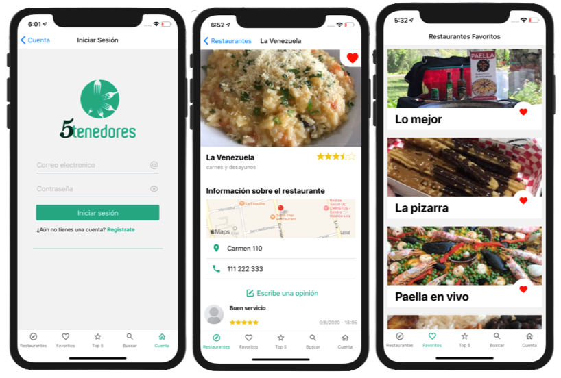
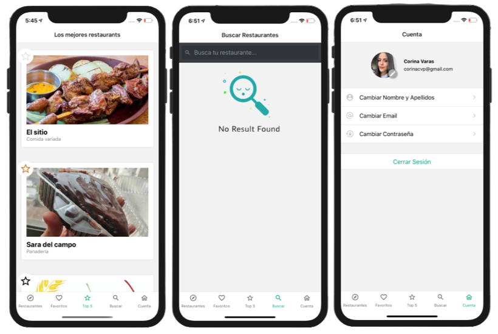

## Definición del producto

Es una app de TripAdvisor de restaurantes, donde podrás publicar tu restaurante y muchas cosas más.

## Usuario Objetivo

Nuestro público objetivo va dirigido a dos tipos de usuarios, dueños de restaurantes que quisieran dar a conocer su negocio y llegar a más clientes y usuarios consumidores de aplicaciones para la busqueda de su restaturante ideal.

## Stack tecnológico

### Este proyecto fue construido con:

- React Native

- Sistema de navegación SideMenu y BottomMenu.

- Hooks

- React Native Elements.

- Expo y sus herramientas.

- Firebase y Firestore.

- Autenticación en tiempo real con Firebase.

- Geolocalización y los mapas.

- Toast compatibles con Android y iOS.

## Interfaz de usuario

## Flujo de la App

## Link de la App 📱

Puedes encontrar la app publicada en Expo en el siguiente [link](https://expo.io/@corinavaras/5-tenedores)
